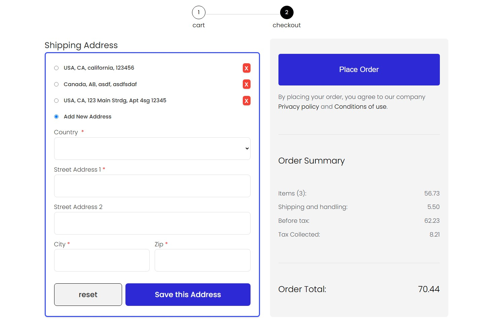

# Shufersal

This project was generated using [Angular CLI](https://github.com/angular/angular-cli) version 19.0.1.

## Table of Contents

- [Shufersal](#shufersal)
	- [Table of Contents](#table-of-contents)
	- [Introduction](#introduction)
	- [Features](#features)
	- [Installation](#installation)
	- [Key concepts](#key-concepts)
	- [License](#license)

## Introduction

Shufersal is a web application designed mimic a checkout page for an e-commerce store.Currently, it provides a user-friendly interface for adding, editing, and deleting addresses.



## Features

- Add new addresses
- Edit existing addresses
- Delete addresses
- Form validation
- Responsive design

## Installation

To install and run this project locally, follow these steps (the environment variables are already included in the project):

1. Clone the repository:

   ```sh
   git clone https://github.com/your-username/shufersal.git
   cd shufersal
   ```

2. Then run the `init` script:

   ```sh
   npm run init
   ```

   This will install all dependecies, and open your default browser on [http://localhost:4200](http://localhost:4200).

## Key concepts

The styling was meant to closely resemble the following [Figma Page](https://www.figma.com/community/file/1277564093615415741/checkout-page).
There have been slight adjustments, so WCAG AAA standards could be adhered. Also, an address list is not in the design, so i took creative liberty with it.
Chrome's CSS Overview greatly helped with the a11y considerations.

There were many more features I would have wished i could add - however, due to time constraints, I was unable to.
Some of these are:

1. Loading States, Errors - Currently, the implementation relies on constant 200/201 responses and user connection.
   However, in the real world - we know that's not the case for all of the time, and we should prepare for all responses.
2. Language Selection - Change between english and hebrew, and use more modern css properties such as `margin-block-start`, etc..
   As to allow for reuse of existing styling, while marking as RTL when needed.
3. Implementing a NGRX Store - Managing state through ngrx would greatly benefit the app, and the communication between the services and components.

## License

This project is licensed under the MIT License. See the LICENSE file for more details.
